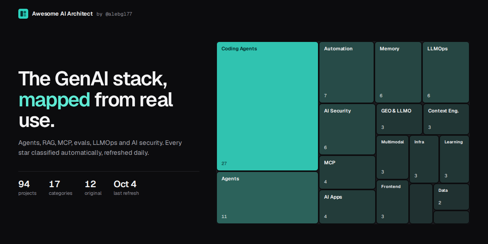

# Awesome AI Architect

     

> A self-updating map of the GenAI engineering stack: agents, RAG, MCP, evals, LLMOps and AI security. Classified automatically from the GitHub stars and open-source work of an AI architect.

**[Open the interactive explorer](https://alebgl77.github.io/awesome-ai-architect/)**: search, filter by category, sort by stars, momentum or recency.

85 starred projects and 12 original projects across 17 categories. Regenerated every day by GitHub Actions from [@alebgl77](https://github.com/alebgl77)'s stars: star a repository and it shows up here, classified, the next morning.

**Want this for your own stars?** [Use this template](https://github.com/alebgl77/awesome-ai-architect/generate), then run the workflow once. Two clicks, no config, no API key, no Pages setup. See [Use it for your own stars](#use-it-for-your-own-stars). If the map helps you, a star keeps it visible.

## Contents

- [Recently starred](#recently-starred)
- [Rising](#rising)
- [MCP & Tool Use](#mcp--tool-use) (3)
- [Agent Memory & Persistent Context](#agent-memory--persistent-context) (6)
- [Observability, LLMOps & FinOps](#observability-llmops--finops) (3)
- [AI Security, Safety & Governance](#ai-security-safety--governance) (5)
- [Generative Search, GEO & LLMO](#generative-search-geo--llmo) (2)
- [Prompt & Context Engineering](#prompt--context-engineering) (2)
- [AI Coding Agents & Skills](#ai-coding-agents--skills) (24)
- [Agent Frameworks & Orchestration](#agent-frameworks--orchestration) (11)
- [Inference, Serving & Model Routing](#inference-serving--model-routing) (2)
- [Models, Training & Fine-tuning](#models-training--fine-tuning) (2)
- [Vision, Voice & Generative Media](#vision-voice--generative-media) (3)
- [Data Engineering, Scraping & Analytics](#data-engineering-scraping--analytics) (3)
- [Automation, Browser Agents & Productivity](#automation-browser-agents--productivity) (7)
- [Frontend, Design & Generative UI](#frontend-design--generative-ui) (2)
- [Cloud, DevOps & Infrastructure](#cloud-devops--infrastructure) (3)
- [AI Apps & Chat Interfaces](#ai-apps--chat-interfaces) (4)
- [Learning, Papers & Awesome Lists](#learning-papers--awesome-lists) (3)
- [Built by Alexandre](#built-by-alexandre) (12)
- [How it works](#how-it-works)
- [Use it for your own stars](#use-it-for-your-own-stars)
- [Suggest a project](#suggest-a-project)

## Recently starred

| Project | What it does | Stars | Category | Last push |
|:--|:--|--:|:--|:--|
| [**gridex**](https://github.com/gridex/gridex) gridex | A native macOS / windows / Linux database IDE built with Swift and AppKit. Connect to PostgreSQL, MySQL, SQLite, and Redis from a single app with a fast, keyboard-driven interface. | 1.8k | Data Engineering, Scraping & Analytics | 2026-09 |
| [**paperless-ngx**](https://github.com/paperless-ngx/paperless-ngx) paperless-ngx | A community-supported supercharged document management system: scan, index and archive all your documents `machine-learning` `ocr` `ai` `dms` | 46.4k | Models, Training & Fine-tuning | 2026-10 |
| [**e2e**](https://github.com/tester-army/e2e) tester-army | Next generation e2e testing framework for web and mobile apps. `playwright` `e2e` `web` `mobile` | 8k | Automation, Browser Agents & Productivity | 2026-10 |
| [**jevgrep**](https://github.com/dzhng/jevgrep) dzhng | Find code by asking what it does. A CLI for coding agents that uses Jev to discover relevant files and source context. `codex` `claude-code` `coding-agents` `semantic-search` | 2.4k +227 | AI Coding Agents & Skills | 2026-10 |
| [**vibeflow-os**](https://github.com/picmakpro/vibeflow-os) picmakpro | Modules VibeFlow distribués aux labs (consolidator, infrastructure-audit, validator) | 53 +9 | Cloud, DevOps & Infrastructure | 2026-10 |
| [**claude-code-best-practice**](https://github.com/shanraisshan/claude-code-best-practice) shanraisshan | from vibe coding to agentic engineering - practice makes claude perfect `claude-code` `vibe-coding` `agentic-ai` `context-engineering` | 67.3k +204 | AI Coding Agents & Skills | 2026-10 |
| [**pwneye**](https://github.com/Hackerest/pwneye) Hackerest | Your ONVIF and RTSP camera companion for discovering and hacking real-world security cameras 🎥 `security` `pentesting` `security-tools` `cctv` | 350 +11 | AI Security, Safety & Governance | 2026-09 |
| [**mimik**](https://github.com/westpoint-io/mimik) westpoint-io | 🪄 A browser extension that captures your workflow as you click and turns it into a step-by-step guide with annotated screenshots 📸 `workflow` `productivity` `chrome-extension` `react` | 1.5k +48 | Automation, Browser Agents & Productivity | 2026-10 |
| [**ZCode**](https://github.com/zai-org/ZCode) zai-org | Z.ai's coding agent harness. Powerful, intelligent, extensible. | 7.5k +148 | AI Coding Agents & Skills | 2026-09 |
| [**reverse-skill**](https://github.com/zhaoxuya520/reverse-skill) zhaoxuya520 | Reverse Engineering / Authorized Penetration Testing / Security Research Skill Router Pack AI-powered routing + On-demand toolchain bootstrapping + Self-evolving knowledge base  Supports Claude Code, Kiro, Cursor, Cline, and other AI coding clients 逆向/渗透/安全技能路由包 - AI 自动路由 + 按需自举工具链 + 自动进化经验库 \| 支持 Claude Code / Kiro / Cursor / Cline 等代码 AI 客户端 | 40.2k +623 | AI Coding Agents & Skills | 2026-09 |

## Rising

Most stars gained over the last 4 days among starred projects.

| Project | What it does | Stars | Category | Last push |
|:--|:--|--:|:--|:--|
| [**skills**](https://github.com/mattpocock/skills) mattpocock | Skills for Real Engineers. Straight from my .agents directory. | 280.5k +4.9k | AI Coding Agents & Skills | 2026-10 |
| [**Agent-Reach**](https://github.com/Panniantong/Agent-Reach) Panniantong | Give your AI agent eyes to see the entire internet. Read & search Twitter, Reddit, YouTube, GitHub, Bilibili, XiaoHongShu — one CLI, zero API fees. `claude-code` `mcp` `ai-search` `cli` | 93.8k +3.7k | AI Coding Agents & Skills | 2026-10 |
| [**odysseus**](https://github.com/odysseus-dev/odysseus) odysseus-dev | Self-hosted AI workspace. | 92k +2.8k | AI Apps & Chat Interfaces | 2026-10 |
| [**ECC**](https://github.com/affaan-m/ECC) affaan-m | The agent harness performance optimization system. Skills, instincts, memory, security, and research-first development for Claude Code, Codex, Opencode, Cursor and beyond. `claude-code` `mcp` `productivity` `claude` | 275.2k +2.7k | AI Coding Agents & Skills | 2026-10 |
| [**deepseek-harness**](https://github.com/deepseek-ai/deepseek-harness) deepseek-ai | DeepSeek Harness: Everything is a Plugin. `ai-agents` `dsh` `cordis` `dsh-plugin` | 245.7k +2.6k | Agent Frameworks & Orchestration | 2026-10 |
| [**claude-mem**](https://github.com/thedotmack/claude-mem) thedotmack | Persistent Context Across Sessions for Every Agent –  Captures everything your agent does during sessions, compresses it with AI, and injects relevant context back into future sessions. Works with Claude Code, OpenClaw, Codex, Gemini, Hermes, Copilot, OpenCode + More `mem0` `long-term-memory` `claude-code` `claude-skills` | 98.1k +2.3k | Agent Memory & Persistent Context | 2026-10 |
| [**agent-skills**](https://github.com/addyosmani/agent-skills) addyosmani | Production-grade engineering skills for AI coding agents. `codex` `skills` `claude-code` `agent-skills` | 103.2k +2.2k | AI Coding Agents & Skills | 2026-10 |
| [**superpowers**](https://github.com/obra/superpowers) obra | An agentic skills framework & software development methodology that works. `skills` `coding` `ai` `obra` | 296.6k +1.6k | AI Coding Agents & Skills | 2026-10 |
| [**taste-skill**](https://github.com/Leonxlnx/taste-skill) Leonxlnx | Taste-Skill - gives your AI good taste. stops the AI from generating boring, generic slop `codex` `skill` `skills` `vibecoding` | 93.7k +1.3k | AI Coding Agents & Skills | 2026-10 |
| [**graphify**](https://github.com/Graphify-Labs/graphify) Graphify-Labs | Turn any codebase, with its docs, SQL schemas, configs, and PDFs, into a queryable knowledge graph. A /graphify skill for Claude Code, Cursor, Codex, and Gemini CLI: local deterministic AST parsing, every edge explained, no vector store. `codex` `skills` `claude-code` `rag` | 124.8k +1.2k | AI Coding Agents & Skills | 2026-10 |

## MCP & Tool Use

Model Context Protocol servers, clients, gateways and function-calling infrastructure.

| Project | What it does | Stars | Language | Last push |
|:--|:--|--:|:--|:--|
| [**chrome-devtools-mcp**](https://github.com/ChromeDevTools/chrome-devtools-mcp) ChromeDevTools | Chrome DevTools for coding agents `mcp` `mcp-server` `puppeteer` `chrome` | 53.1k +176 | TypeScript | 2026-10 |
| [**paperbanana**](https://github.com/llmsresearch/paperbanana) llmsresearch | Open source implementation and extension of Google Research’s PaperBanana for automated academic figures, diagrams, and research visuals, expanded to new domains like slide generation. `mcp` `mcp-server` `agentic-ai` `multiagent` | 2.4k +3 | Python | 2026-09 |
| [**wordpress-mcp**](https://github.com/Automattic/wordpress-mcp) Automattic | **Archived.** WordPress MCP — This repository will be deprecated as stable releases of mcp-adapter become available. Please use https://github.com/WordPress/mcp-adapter for ongoing development and support. | 945 +1 | PHP | 2026-09 |

## Agent Memory & Persistent Context

Long-term memory layers, persistent context across sessions and knowledge stores for agents.

| Project | What it does | Stars | Language | Last push |
|:--|:--|--:|:--|:--|
| [**claude-mem**](https://github.com/thedotmack/claude-mem) thedotmack | Persistent Context Across Sessions for Every Agent –  Captures everything your agent does during sessions, compresses it with AI, and injects relevant context back into future sessions. Works with Claude Code, OpenClaw, Codex, Gemini, Hermes, Copilot, OpenCode + More `mem0` `long-term-memory` `claude-code` `claude-skills` | 98.1k +2.3k | TypeScript | 2026-10 |
| [**supermemory**](https://github.com/supermemoryai/supermemory) supermemoryai | Memory and context engine + app that is extremely fast, scalable, and can be run fully locally. The Memory API for the AI era. `memory` `agent-memory` `tailwindcss` `vite` | 31.2k +86 | TypeScript | 2026-10 |
| [**agentmemory**](https://github.com/rohitg00/agentmemory) rohitg00 | #1 Persistent memory for AI coding agents based on real-world benchmarks `memory` `codex` `copilot` `claude` | 29.2k +112 | TypeScript | 2026-10 |
| [**TencentDB-Agent-Memory**](https://github.com/TencentCloud/TencentDB-Agent-Memory) TencentCloud | TencentDB Agent Memory is a team-level memory hub for AI Agents — turning conversations, docs, and code into four reusable memory assets (Chat Memory, Skill, LLM-Wiki, Code-Graph) that are governed, shared, and equipped across agents and frameworks. `memory` `long-term-memory` `embedding` `vector-search` | 27.8k +129 | TypeScript | 2026-09 |
| [**memsearch**](https://github.com/zilliztech/memsearch) zilliztech | A persistent, unified memory layer for all your AI agents (e.g. Claude Code, Codex, DSH), backed by Markdown and Milvus. `memory` `agent-memory` `long-term-memory` `rag` | 2.7k +18 | Python | 2026-09 |
| [**google-memorybank-plugin**](https://github.com/Shubhamsaboo/google-memorybank-plugin) Shubhamsaboo | Vertex AI Memory Bank Plugin for OpenClaw | 158 +1 | TypeScript | 2026-10 |

## Observability, LLMOps & FinOps

Tracing, monitoring, cost tracking and operations for LLM applications and agents in production.

| Project | What it does | Stars | Language | Last push |
|:--|:--|--:|:--|:--|
| [**grafana**](https://github.com/grafana/grafana) grafana | The open and composable observability and data visualization platform. Visualize metrics, logs, and traces from multiple sources like Prometheus, Loki, Elasticsearch, InfluxDB, Postgres and many more. `grafana` `monitoring` `prometheus` `data-visualization` | 77.1k +80 | TypeScript | 2026-10 |
| [**loki**](https://github.com/grafana/loki) grafana | Like Prometheus, but for logs. `grafana` `prometheus` `loki` `logging` | 29k +9 | Go | 2026-10 |
| [**librechat-prom-exporter**](https://github.com/rubentalstra/librechat-prom-exporter) rubentalstra | A lightweight Node.js service built with Express, Mongoose, and prom-client that collects metrics from your LibreChat MongoDB database and exposes them on a "/metrics" endpoint for Prometheus scraping. Easily integrate with Grafana dashboards for comprehensive monitoring and visualization. `prometheus` `librechat` `exporter` | 36 | MDX | 2026-10 |

## AI Security, Safety & Governance

Guardrails, prompt-injection defense, agent security scanning, privacy and AI governance or compliance.

| Project | What it does | Stars | Language | Last push |
|:--|:--|--:|:--|:--|
| [**shannon**](https://github.com/KeygraphHQ/shannon) KeygraphHQ | Shannon is an AI pentester for web applications and APIs. It analyzes your source code, identifies attack vectors, and executes real exploits to prove vulnerabilities before they reach production. `appsec` `security` `pentesting` `ai-security` | 48.7k +106 | TypeScript | 2026-10 |
| [**semgrep**](https://github.com/semgrep/semgrep) semgrep | Lightweight static analysis for many languages. Find bug variants with patterns that look like source code. `sast` `static-analysis` `c` `go` | 16.9k +64 | C | 2026-10 |
| [**agentshield**](https://github.com/affaan-m/agentshield) affaan-m | AI agent security scanner. Detect vulnerabilities in agent configurations, MCP servers, and tool permissions. Available as CLI, GitHub Action, ECC plugin, and GitHub App integration. 🛡️ `security` `mcp` `claude-code` `opus` | 1.3k +12 | TypeScript | 2026-09 |
| [**pwneye**](https://github.com/Hackerest/pwneye) Hackerest | Your ONVIF and RTSP camera companion for discovering and hacking real-world security cameras 🎥 `security` `pentesting` `security-tools` `cctv` | 350 +11 | Python | 2026-09 |
| [**claude-security-audit**](https://github.com/VicKayro/claude-security-audit) VicKayro | Skill Claude Code pour audit de sécurité complet (OWASP Top 10, CWE/CVE, headers, auth, paywall, infra) | 80 |  | 2026-03 |

## Generative Search, GEO & LLMO

Visibility in AI answers: generative engine optimization, AI search monitoring and SEO for LLMs.

| Project | What it does | Stars | Language | Last push |
|:--|:--|--:|:--|:--|
| [**claude-seo**](https://github.com/AgriciDaniel/claude-seo) AgriciDaniel | Universal SEO skill for Claude Code. 26 sub-skills + 19 sub-agents covering technical SEO, E-E-A-T, schema, GEO/AEO, agent readiness (Lighthouse Agentic Browsing, WebMCP, llms.txt), backlinks, local SEO, e-commerce, international SEO, Google APIs, and PDF/Excel reporting. 9 optional extensions for live SEO data. `seo` `claude-code` `ai` `ai-seo` | 18.5k +257 | Python | 2026-10 |
| [**Citatra**](https://github.com/Citatra/Citatra) Citatra | Citatra is an open-source platform for AEO/GEO. Designed for marketers and SEO professionals, it helps you monitor competitors, analyze backlinks, and gain actionable intelligence to optimize your visibility on AI search. `aeo` `geo` `ai` `ai-analytics` | 16 | TypeScript | 2026-02 |

## Prompt & Context Engineering

Prompt design and optimization, context engineering, structured outputs and instruction profiling.

| Project | What it does | Stars | Language | Last push |
|:--|:--|--:|:--|:--|
| [**gsd-core**](https://github.com/open-gsd/gsd-core) open-gsd | Git. Ship. Done - Core `context-engineering` `claude-code` `meta-prompting` `spec-driven-development` | 10.3k +153 | JavaScript | 2026-10 |
| [**awesome-harness-engineering**](https://github.com/ai-boost/awesome-harness-engineering) ai-boost | Awesome list for AI agent harness engineering: tools, patterns, evals, memory, MCP, permissions, observability, and orchestration. `context-engineering` `harness-engineering` `awesome-list` `mcp` | 4.8k +59 | Python | 2026-10 |

## AI Coding Agents & Skills

Coding agents, IDE copilots, agent skills, plugins and harness tooling for Claude Code, Codex, Cursor and peers.

| Project | What it does | Stars | Language | Last push |
|:--|:--|--:|:--|:--|
| [**superpowers**](https://github.com/obra/superpowers) obra | An agentic skills framework & software development methodology that works. `skills` `coding` `ai` `obra` | 296.6k +1.6k | Shell | 2026-10 |
| [**skills**](https://github.com/mattpocock/skills) mattpocock | Skills for Real Engineers. Straight from my .agents directory. | 280.5k +4.9k | Shell | 2026-10 |
| [**ECC**](https://github.com/affaan-m/ECC) affaan-m | The agent harness performance optimization system. Skills, instincts, memory, security, and research-first development for Claude Code, Codex, Opencode, Cursor and beyond. `claude-code` `mcp` `productivity` `claude` | 275.2k +2.7k | JavaScript | 2026-10 |
| [**spec-kit**](https://github.com/github/spec-kit) github | 💫 Toolkit to help you get started with SDD or any other process! `copilot` `ai` `prd` `spec` | 140.6k +586 | Python | 2026-10 |
| [**gstack**](https://github.com/garrytan/gstack) garrytan | Use Garry Tan's exact Claude Code setup: 23 opinionated tools that serve as CEO, Designer, Eng Manager, Release Manager, Doc Engineer, and QA | 135.8k +797 | TypeScript | 2026-10 |
| [**graphify**](https://github.com/Graphify-Labs/graphify) Graphify-Labs | Turn any codebase, with its docs, SQL schemas, configs, and PDFs, into a queryable knowledge graph. A /graphify skill for Claude Code, Cursor, Codex, and Gemini CLI: local deterministic AST parsing, every edge explained, no vector store. `codex` `skills` `claude-code` `rag` | 124.8k +1.2k | Python | 2026-10 |
| [**agent-skills**](https://github.com/addyosmani/agent-skills) addyosmani | Production-grade engineering skills for AI coding agents. `codex` `skills` `claude-code` `agent-skills` | 103.2k +2.2k | JavaScript | 2026-10 |
| [**open-design**](https://github.com/nexu-io/open-design) nexu-io | 🎨 Best DeepSeek Harness Design Plugin. The open-source Claude Design alternative. 🖥️ Local-first desktop app. 🖼️ Your coding agent becomes the design engine: prototypes, landing pages, dashboards, slides, images & video — real files, HTML/PDF/PPTX/MP4 export. 🤖 Claude Code / Codex / Cursor / DeepSeek Harness / OpenCode & 20+ CLIs via BYOK. `vibe-coding` `agent-skills` `coding-agents` `design-systems` | 100k +623 | TypeScript | 2026-10 |
| [**Agent-Reach**](https://github.com/Panniantong/Agent-Reach) Panniantong | Give your AI agent eyes to see the entire internet. Read & search Twitter, Reddit, YouTube, GitHub, Bilibili, XiaoHongShu — one CLI, zero API fees. `claude-code` `mcp` `ai-search` `cli` | 93.8k +3.7k | Python | 2026-10 |
| [**taste-skill**](https://github.com/Leonxlnx/taste-skill) Leonxlnx | Taste-Skill - gives your AI good taste. stops the AI from generating boring, generic slop `codex` `skill` `skills` `vibecoding` | 93.7k +1.3k | JavaScript | 2026-10 |
| [**awesome-claude-skills**](https://github.com/ComposioHQ/awesome-claude-skills) ComposioHQ | A curated list of awesome Claude Skills, resources, and tools for customizing Claude AI workflows `codex` `skill` `gemini-cli` `claude-code` | 76.7k +250 | Python | 2026-09 |
| [**claude-code-best-practice**](https://github.com/shanraisshan/claude-code-best-practice) shanraisshan | from vibe coding to agentic engineering - practice makes claude perfect `claude-code` `vibe-coding` `agentic-ai` `context-engineering` | 67.3k +204 | HTML | 2026-10 |
| [**awesome-claude-code**](https://github.com/hesreallyhim/awesome-claude-code) hesreallyhim | A hand-picked collection of the finest of resources for the most awesome of agents, Claude Code, the undisputed champion of coding companions, from the unstoppable team at Anthropic PBC. A delectable showcase of top tier skills, ambidextrous agents, scintillating status lines, top notch developer tooling, and also we have plugins `claude-code` `agent-skills` `coding-agent` `coding-agents` | 55.2k +199 | Python | 2026-10 |
| [**humanizer**](https://github.com/blader/humanizer) blader | Agent skill that removes signs of AI-generated writing from text `codex` `claude-code` `agent-skills` `prompt-engineering` | 54.8k +978 | Python | 2026-09 |
| [**obsidian-skills**](https://github.com/kepano/obsidian-skills) kepano | Agent skills for Obsidian. Teach your agent to use Obsidian CLI and open formats including Markdown, Bases, JSON Canvas. `codex` `skills` `obsidian` `cli` | 49.3k +144 |  | 2026-09 |
| [**herdr**](https://github.com/herdrdev/herdr) herdrdev | the runtime your coding agents live on `codex` `claude-code` `coding-agents` `cli` | 42.9k +760 | Rust | 2026-10 |
| [**reverse-skill**](https://github.com/zhaoxuya520/reverse-skill) zhaoxuya520 | Reverse Engineering / Authorized Penetration Testing / Security Research Skill Router Pack AI-powered routing + On-demand toolchain bootstrapping + Self-evolving knowledge base  Supports Claude Code, Kiro, Cursor, Cline, and other AI coding clients 逆向/渗透/安全技能路由包 - AI 自动路由 + 按需自举工具链 + 自动进化经验库 \| 支持 Claude Code / Kiro / Cursor / Cline 等代码 AI 客户端 | 40.2k +623 | PowerShell | 2026-09 |
| [**openwiki**](https://github.com/langchain-ai/openwiki) langchain-ai | OpenWiki is a CLI that writes and maintains agent documentation for your codebase. | 17k +71 | TypeScript | 2026-10 |
| [**OpenSpace**](https://github.com/HKUDS/OpenSpace) HKUDS | "OpenSpace: The Skill Management Layer for AI Agents" -- https://open-space.cloud/ | 7.7k +8 | Python | 2026-08 |
| [**ZCode**](https://github.com/zai-org/ZCode) zai-org | Z.ai's coding agent harness. Powerful, intelligent, extensible. | 7.5k +148 | TypeScript | 2026-09 |

4 more in AI Coding Agents & Skills

| Project | What it does | Stars | Language | Last push |
|:--|:--|--:|:--|:--|
| [**skills**](https://github.com/trailofbits/skills) trailofbits | Trail of Bits Claude Code skills for security research, vulnerability detection, and audit workflows `agent-skills` | 7.4k +73 | Python | 2026-10 |
| [**tons-of-skills-marketplace**](https://github.com/jeremylongshore/tons-of-skills-marketplace) jeremylongshore | Model-agnostic agent-skills platform with a harness-free canonical layer, verified adapters, and the ccpi package manager. Explore at tonsofskills.com. `skills` `claude-code` `agent-skills` `mcp` | 2.8k +16 | Python | 2026-10 |
| [**jevgrep**](https://github.com/dzhng/jevgrep) dzhng | Find code by asking what it does. A CLI for coding agents that uses Jev to discover relevant files and source context. `codex` `claude-code` `coding-agents` `semantic-search` | 2.4k +227 | TypeScript | 2026-10 |
| [**helmor**](https://github.com/dohooo/helmor) dohooo | Open-source local workbench for multi-agent software development. `codex` `claude-code` `coding-agents` `multi-agent` | 1.3k +3 | TypeScript | 2026-08 |

## Agent Frameworks & Orchestration

Frameworks and runtimes for single and multi-agent systems, planning, memory and orchestration.

| Project | What it does | Stars | Language | Last push |
|:--|:--|--:|:--|:--|
| [**deepseek-harness**](https://github.com/deepseek-ai/deepseek-harness) deepseek-ai | DeepSeek Harness: Everything is a Plugin. `ai-agents` `dsh` `cordis` `dsh-plugin` | 245.7k +2.6k | TypeScript | 2026-10 |
| [**deer-flow**](https://github.com/bytedance/deer-flow) bytedance | An open-source long-horizon SuperAgent harness that researches, codes, and creates. With the help of sandboxes, memories, tools, skill, subagents and message gateway, it handles different levels of tasks that could take minutes to hours. `agentic` `langchain` `langgraph` `multi-agent` | 83.5k +136 | Python | 2026-10 |
| [**ruflo**](https://github.com/ruvnet/ruflo) ruvnet | 🌊 The original agent harness. Deploy intelligent multi-player swarms, coordinate autonomous workflows, and build conversational AI systems. Features adaptive memory, self-learning intelligence, federation, vector RAG integration, and native Claude Code / Codex / Hermes and many more Integrated `swarm` `agentic-ai` `multi-agent` `autonomous-agents` | 74.1k +287 | TypeScript | 2026-10 |
| [**autogen**](https://github.com/microsoft/autogen) microsoft | A programming framework for agentic AI `agentic` `autogen` `llm-agent` `agents` | 61.3k +48 | Python | 2026-04 |
| [**crewAI**](https://github.com/crewAIInc/crewAI) crewAIInc | Framework for orchestrating role-playing, autonomous AI agents. By fostering collaborative intelligence, CrewAI empowers agents to work together seamlessly, tackling complex tasks. `aiagentframework` `agents` `ai-agents` `ai` | 59.5k +123 | Python | 2026-10 |
| [**multica**](https://github.com/multica-ai/multica) multica-ai | Make humans and AI agents work as one team — open-source and self-hostable. | 52.2k +261 | Go | 2026-10 |
| [**nanobot**](https://github.com/HKUDS/nanobot) HKUDS | Ultra-lightweight, open-source, self-hosted personal AI agent framework in Python with WebUI, tools, memory, MCP, multi-agent workflows, automation, and chat apps `multi-agent` `agent-framework` `webui` `chatbot` | 48.9k +86 | Python | 2026-10 |
| [**MiMo-Code**](https://github.com/XiaomiMiMo/MiMo-Code) XiaomiMiMo | MiMo Code: Where Models and Agents Co-Evolve `ai-agents` `ai` `cli` `mimo` | 13.6k +17 | TypeScript | 2026-10 |
| [**swarms**](https://github.com/kyegomez/swarms) kyegomez | The Enterprise-Grade Multi-Agent Orchestration Framework. Website: https://swarms.ai `langchain` `agentic-ai` `multi-agent-systems` `prompt-engineering` | 7.2k +6 | Python | 2026-10 |
| [**bigset-oss**](https://github.com/tinyfish-io/bigset-oss) tinyfish-io | Open-source BigSet — self-hostable live datasets populated by TinyFish web agents `bigset` `tinyfish` `open-source` | 1.7k +2 | TypeScript | 2026-10 |
| [**n8n-openai-bridge**](https://github.com/sveneisenschmidt/n8n-openai-bridge) sveneisenschmidt | OpenAI-compatible API middleware for n8n workflows. Use your n8n agents and workflows as OpenAI models in any OpenAI-compatible client. | 131 | JavaScript | 2026-03 |

## Inference, Serving & Model Routing

Local and production inference engines, quantization, AI gateways and model routers.

| Project | What it does | Stars | Language | Last push |
|:--|:--|--:|:--|:--|
| [**llama.cpp**](https://github.com/ggml-org/llama.cpp) ggml-org | LLM inference in C/C++ `ggml` | 130.7k +408 | C++ | 2026-10 |
| [**litellm**](https://github.com/BerriAI/litellm) BerriAI | The fastest, litest AI Gateway. Rust core with Python SDK. Call 100+ LLM APIs in OpenAI (or native) format with cost tracking, guardrails, load balancing, and logging [Bedrock, Azure, OpenAI, Anthropic, OpenAI, VertexAI, vLLM, Nvidia NIM] `gateway` `litellm` `ai-gateway` `llm-gateway` | 60.4k +240 | Python | 2026-10 |

## Models, Training & Fine-tuning

Foundation models, fine-tuning, distillation, reinforcement learning, datasets and ML frameworks.

| Project | What it does | Stars | Language | Last push |
|:--|:--|--:|:--|:--|
| [**paperless-ngx**](https://github.com/paperless-ngx/paperless-ngx) paperless-ngx | A community-supported supercharged document management system: scan, index and archive all your documents `machine-learning` `ocr` `ai` `dms` | 46.4k | Python | 2026-10 |
| [**kimi-k3-in-c**](https://github.com/FareedKhan-dev/kimi-k3-in-c) FareedKhan-dev | A 2.78-trillion-parameter Kimi K3 running inference on a single CPU in 8.24 GB of RAM. Portable C99: no BLAS, no framework, no GPU. `transformer` `deep-learning` `machine-learning` `quantization` | 8.9k +66 | C | 2026-10 |

## Vision, Voice & Generative Media

Speech, text-to-speech, OCR, computer vision, image and video generation and multimodal models.

| Project | What it does | Stars | Language | Last push |
|:--|:--|--:|:--|:--|
| [**Deep-Live-Cam**](https://github.com/hacksider/Deep-Live-Cam) hacksider | real time face swap and one-click video deepfake with only a single image `deepfake` `ai` `gan` `webcam` | 96.9k +30 | Python | 2026-10 |
| [**meetily**](https://github.com/Zackriya-Solutions/meetily) Zackriya-Solutions | Privacy first, AI meeting assistant with 4x faster Parakeet/Whisper live transcription, speaker diarization, and Ollama summarization built on Rust. 100% local processing. no cloud required. Meetily (Meetly Ai - https://meetily.ai) is the #1 Self-hosted, Open-source Ai meeting note taker for macOS & Windows. Understand How to write meeting minutes `whisper` `meeting-notes` `transcription` `speech-to-text` | 31.5k +115 | Rust | 2026-09 |
| [**vexa**](https://github.com/Vexa-ai/vexa) Vexa-ai | Open-source meeting transcription API for Google Meet, Microsoft Teams & Zoom. Auto-join bots, real-time WebSocket transcripts, MCP server for AI agents. Self-host or use hosted SaaS. `meeting-notes` `transcription` `speech-to-text` `mcp` | 2.9k +15 | Python | 2026-10 |

## Data Engineering, Scraping & Analytics

Pipelines, web crawling for LLMs, text-to-SQL, warehouses and analytics tooling.

| Project | What it does | Stars | Language | Last push |
|:--|:--|--:|:--|:--|
| [**Scrapling**](https://github.com/D4Vinci/Scrapling) D4Vinci | 🕷️ An adaptive Web Scraping framework that handles everything from a single request to a full-scale crawl! Don't be shy, join here: https://discord.gg/EMgGbDceNQ and follow here for daily tips and tricks: https://x.com/Scrapling_dev `crawler` `scraping` `web-scraping` `mcp` | 86.3k +767 | Python | 2026-10 |
| [**awesome-web-scraping**](https://github.com/lorien/awesome-web-scraping) lorien | List of libraries, tools and APIs for web scraping and data processing. `crawler` `scraping` `web-scraping` `spider` | 8.2k +3 | JavaScript | 2026-09 |
| [**gridex**](https://github.com/gridex/gridex) gridex | A native macOS / windows / Linux database IDE built with Swift and AppKit. Connect to PostgreSQL, MySQL, SQLite, and Redis from a single app with a fast, keyboard-driven interface. | 1.8k | C++ | 2026-09 |

## Automation, Browser Agents & Productivity

Workflow automation, browser and computer-use agents, extensions and everyday productivity tools.

| Project | What it does | Stars | Language | Last push |
|:--|:--|--:|:--|:--|
| [**obscura**](https://github.com/h4ckf0r0day/obscura) h4ckf0r0day | The headless browser for AI agents and web scraping `puppeteer` `playwright` `browser-automation` `cdp` | 28.7k +372 | Rust | 2026-10 |
| [**obsidian-releases**](https://github.com/obsidianmd/obsidian-releases) obsidianmd | Community plugins list, theme list, and releases of Obsidian. `obsidian` `obsidian-md` `md` `bases` | 22.1k +83 |  | 2026-10 |
| [**artemis**](https://github.com/google/artemis) google | ARTEMIS turns natural-language instructions into reliable Android automation. It automates end-to-end workflows, captures logs, and integrates seamlessly with AI coding assistants such as Antigravity, Codex, and Claude Code.  It also achieves 99%+ success rate on AndroidWorld Benchmark. `google` `android` `testing` `ai-agents` | 11.1k +196 | Python | 2026-10 |
| [**e2e**](https://github.com/tester-army/e2e) tester-army | Next generation e2e testing framework for web and mobile apps. `playwright` `e2e` `web` `mobile` | 8k | TypeScript | 2026-10 |
| [**n8n-skills**](https://github.com/czlonkowski/n8n-skills) czlonkowski | n8n skillset for Claude Code to build flawless n8n workflows `n8n` `workflow-automation` `ai-agents` | 6.4k +24 | Shell | 2026-09 |
| [**mimik**](https://github.com/westpoint-io/mimik) westpoint-io | 🪄 A browser extension that captures your workflow as you click and turns it into a step-by-step guide with annotated screenshots 📸 `workflow` `productivity` `chrome-extension` `react` | 1.5k +48 | TypeScript | 2026-10 |
| [**awesome-workflow-automation**](https://github.com/dariubs/awesome-workflow-automation) dariubs | A curated list of Workflow Automation  Software, Engines and Tools `n8n` `zapier` `workflow` `workflow-automation` | 1.2k +5 |  | 2026-04 |

## Frontend, Design & Generative UI

Design systems, UI components, design taste for AI agents and generative interfaces.

| Project | What it does | Stars | Language | Last push |
|:--|:--|--:|:--|:--|
| [**payload**](https://github.com/payloadcms/payload) payloadcms | Payload is the open-source, fullstack Next.js framework, giving you instant backend superpowers. Get a full TypeScript backend and admin panel instantly. Use Payload as a headless CMS or for building powerful applications. `react` `nextjs` `mongodb` `typescript` | 45.1k +68 | TypeScript | 2026-10 |
| [**design-extract**](https://github.com/Manavarya09/design-extract) Manavarya09 | Extract any website's complete design system with one command. DTCG tokens, semantic+primitive+composite, MCP server for Claude Code/Cursor/Windsurf, multi-platform emitters (iOS SwiftUI, Android Compose, Flutter, WordPress), Tailwind v4, Figma variables, shadcn/ui, CSS health audit, WCAG remediation, Chrome extension. MIT, Playwright, Node 20+. `css` `figma` `tailwind` `accessibility` | 4.2k +16 | HTML | 2026-09 |

## Cloud, DevOps & Infrastructure

Deployment, containers, CI/CD and cloud infrastructure for shipping AI systems.

| Project | What it does | Stars | Language | Last push |
|:--|:--|--:|:--|:--|
| [**neon**](https://github.com/neondatabase/neon) neondatabase | Neon: Serverless Postgres. We separated storage and compute to offer autoscaling, code-like database branching, and scale to zero. `serverless` `rust` `database` `postgres` | 23.2k +9 | Rust | 2026-08 |
| [**OpenSandbox**](https://github.com/opensandbox-group/OpenSandbox) opensandbox-group | Secure, Fast, and Extensible Sandbox runtime for AI agents. `kubernetes` `ai` `sandbox` `ai-agent` | 15.7k +72 | Python | 2026-10 |
| [**vibeflow-os**](https://github.com/picmakpro/vibeflow-os) picmakpro | Modules VibeFlow distribués aux labs (consolidator, infrastructure-audit, validator) | 53 +9 | Shell | 2026-10 |

## AI Apps & Chat Interfaces

End-user AI applications, chat UIs, assistants and business tools built on LLMs.

| Project | What it does | Stars | Language | Last push |
|:--|:--|--:|:--|:--|
| [**odysseus**](https://github.com/odysseus-dev/odysseus) odysseus-dev | Self-hosted AI workspace. | 92k +2.8k | Python | 2026-10 |
| [**LibreChat**](https://github.com/LibreChat-AI/LibreChat) LibreChat-AI | Enhanced ChatGPT Clone: Features Agents, MCP, Skills, DeepSeek, Anthropic, AWS, OpenAI, Responses API, Azure, Groq, o1, GPT-5, Mistral, OpenRouter, Vertex AI, Gemini, Artifacts, AI model switching, message search, Code Interpreter, langchain, DALL-E-3, OpenAPI Actions, Functions, Secure Multi-User Auth, Presets, open-source for self-hosting. Active `webui` `librechat` `aws` `azure` | 45.4k +160 | TypeScript | 2026-10 |
| [**cheating-daddy**](https://github.com/sohzm/cheating-daddy) sohzm | a free and opensource app that lets you gain an unfair advantage | 5.6k +6 | JavaScript | 2026-07 |
| [**AzuraCast**](https://github.com/AzuraCast/AzuraCast) AzuraCast | A self-hosted web radio management suite, including turnkey installer tools for the full radio software stack and a modern, easy-to-use web app to manage your stations. `radio` `icecast` `station` `webcast` | 4.1k +6 | PHP | 2026-10 |

## Learning, Papers & Awesome Lists

Curated lists, courses, cookbooks, tutorials and research references.

| Project | What it does | Stars | Language | Last push |
|:--|:--|--:|:--|:--|
| [**claude-cookbooks**](https://github.com/anthropics/claude-cookbooks) anthropics | A collection of notebooks/recipes showcasing some fun and effective ways of using Claude. | 53.3k +97 | Jupyter Notebook | 2026-09 |
| [**awesome-hermes-agent**](https://github.com/0xNyk/awesome-hermes-agent) 0xNyk | Independent directory of useful skills, plugins, memory providers, tools, surfaces, and guides for Nous Research's open-source Hermes Agent. `awesome` `awesome-list` `skills` `agent-skills` | 5.8k +19 |  | 2026-09 |
| [**awesome-claude-fable-5-prompt-vault**](https://github.com/thenicolas1894/awesome-claude-fable-5-prompt-vault) thenicolas1894 | Ultimate Claude Fable 5 Guide 2026: Use Cases, Integrations & Benchmarks `awesome-list` `prompt-engineering` `benchmarks` `llm` | 142 +1 | HTML | 2026-10 |

## Built by Alexandre

Original open-source work, classified with the same taxonomy.

| Project | What it does | Stars | Category | Last push |
|:--|:--|--:|:--|:--|
| [**claude-inc**](https://github.com/alebgl77/claude-inc) alebgl77 | Your project, an entire virtual company. CEO and CTO, 8 business departments and 54 skill manuals in Claude Code. `claude-code` `claude-skills` `claude-code-plugin` `agentic-ai` | 18 +2 | AI Coding Agents & Skills | 2026-09 |
| [**grafana-llmops-forge**](https://github.com/alebgl77/grafana-llmops-forge) alebgl77 | Grafana-native LLMOps dashboards for FinOps, agents, quality and AI governance, generated and visually verified. `sre` `finops` `llmops` `grafana` | 1 | Observability, LLMOps & FinOps | 2026-09 |
| [**tierdecay**](https://github.com/alebgl77/tierdecay) alebgl77 | Per-repo learning layer for AI coding model routers: learns which task classes can safely run on a cheaper tier. Native for Claude Code, Codex, Antigravity · MCP server · zero deps. `agents-md` `ai-coding` `claude-code` `agent-skills` | 1 | AI Coding Agents & Skills | 2026-10 |
| [**design-md-viewer**](https://github.com/alebgl77/design-md-viewer) alebgl77 | Client-side explorer that parses a design-system markdown file into browsable tokens, a health audit and code exports. `wcag` `react` `design-md` `tailwindcss` | 0 | Frontend, Design & Generative UI | 2026-09 |
| [**dsh-plugin-otel-genai**](https://github.com/alebgl77/dsh-plugin-otel-genai) alebgl77 | OpenTelemetry GenAI metrics for DeepSeek Harness: token usage and step latency per provider and model, exported over OTLP for Grafana and Prometheus `llmops` `grafana` `opentelemetry` `dsh-plugin` | 0 | Observability, LLMOps & FinOps | 2026-09 |
| [**ftp-deploy-mcp**](https://github.com/alebgl77/ftp-deploy-mcp) alebgl77 | MCP server to deploy, inspect and transfer files over FTP/FTPS/SFTP from AI coding agents. Local confinement, SFTP host-key pinning, verified staged promotion, read-only mode and dry runs. Bilingual EN/FR. `mcp` `mcp-tools` `mcp-server` `model-context-protocol` | 0 | MCP & Tool Use | 2026-10 |
| [**generative-engine-monitor**](https://github.com/alebgl77/generative-engine-monitor) alebgl77 | Measure brand visibility in AI answers with explainable scoring, confidence intervals and zero-cost replay. `aeo` `geo` `ai-search` `perplexity` | 0 | Generative Search, GEO & LLMO | 2026-09 |
| [**harnessmeter**](https://github.com/alebgl77/harnessmeter) alebgl77 | Offline profiler for AI agent instructions, skills, subagents and MCP schemas. No API keys or network. `claude-md` `claude-code` `agent-harness` `prompt-engineering` | 0 | AI Coding Agents & Skills | 2026-09 |
| [**open-fullscreenshot**](https://github.com/alebgl77/open-fullscreenshot) alebgl77 | Full-page screen capture extension for Chrome (Manifest V3) — scroll-and-stitch full page, visible area, element or region. activeTab only, no host permissions, no network, no telemetry. | 0 | Automation, Browser Agents & Productivity | 2026-09 |
| [**open-shadow-ai**](https://github.com/alebgl77/open-shadow-ai) alebgl77 | Self-hosted Shadow AI discovery and governance. Evidence-first visibility across network, endpoints, Active Directory and Entra ID. `shadow-ai` `ai-governance` `cybersecurity` `docker` | 0 | AI Security, Safety & Governance | 2026-10 |
| [**openspanguard**](https://github.com/alebgl77/openspanguard) alebgl77 | Make AI quality observable. OpenTelemetry trace enrichment, Jev evaluation, streaming deduplication, and cohort quality alerts. `otlp` `llmops` `grafana` `prometheus` | 0 | Observability, LLMOps & FinOps | 2026-10 |
| [**promptor**](https://github.com/alebgl77/promptor) alebgl77 | Architecte de prompts sur mesure — protocole itératif human-in-the-loop avec mémoire apprenante, pour ChatGPT, Claude, Gemini, Midjourney, Cursor et agents `meta-prompt` `prompt-engineering` `gemini` `chatgpt` | 0 | Prompt & Context Engineering | 2026-07 |

## How it works

1. A scheduled GitHub Action fetches every public star and public original repository of [@alebgl77](https://github.com/alebgl77) through the GitHub API.
2. Each repository is scored against a taxonomy of AI-engineering categories using its topics, name and description. Topics weigh most because maintainers curate them.
3. Daily snapshots of star counts give a momentum signal (stars gained over about 30 days).
4. This README, a JSON dataset and the interactive explorer are regenerated and published.

The taxonomy, weights and manual overrides live in [`config.toml`](config.toml). The generator is a single dependency-free Python file: [`scripts/build.py`](scripts/build.py).

### Why no LLM

Classification is deterministic and explainable: same input, same category, and every project shows the topics that placed it (the first tags in each row). It costs nothing, needs no key and cannot hallucinate a category. On this list, **94 of 97 projects are placed by the rules alone**, 3 by a manual override in `config.toml` and 0 remain to triage. The test suite pins the expected category of reference projects so taxonomy edits cannot drift silently.

## Use it for your own stars

1. Click **[Use this template](https://github.com/alebgl77/awesome-ai-architect/generate)** and create a public repository.
2. In its Actions tab, open **Awesome AI Architect** and click **Run workflow**.

That is all. Your README lists your own stars, classified, and refreshes every day. Your interactive explorer is live at `https://alebgl77.github.io/awesome-ai-architect/?repo=<you>/<repo>` with no Pages setup. The copy detects its owner on its own; edit `config.toml` only to tune the taxonomy.

Optional: set Settings > Pages > Source to **GitHub Actions** to host the explorer on your own domain. Forking works too; GitHub disables scheduled workflows on forks until you enable them in the Actions tab.

No secrets, no API keys and no dependencies: the default `GITHUB_TOKEN` reads public stars.

## Suggest a project

This list mirrors what one practitioner actually uses and follows. Know a project that belongs here? [Open a suggestion](https://github.com/alebgl77/awesome-ai-architect/issues/new?template=suggest.yml). Accepted suggestions get starred, then classified on the next run.

## License

Code: [MIT](LICENSE). List content: [CC0 1.0](https://creativecommons.org/publicdomain/zero/1.0/). Project descriptions belong to their respective authors.
